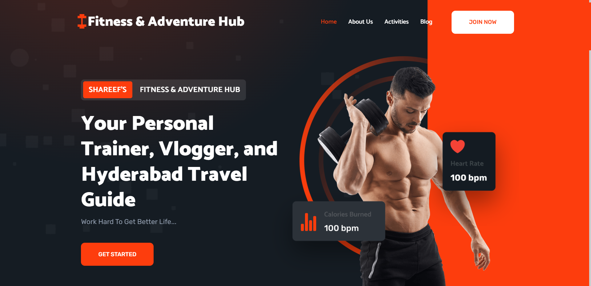

# Fitness Adventure Hub

Fitness Adventure Hub is a Django-based web application that provides fitness-related content, activities, and blogs. This README file will help you get started with setting up and running the project.

## Live Link

[Live Demo](https://www.example.com)

## Screenshots

### Homepage



### Contact Form


### Blog Post


## Developer Profiles

You can connect with the Me or contributors of this project on the following platforms:

- [LinkedIn](https://www.linkedin.com/in/sayikumarr/)
- [GitHub](https://github.com/sayikumarr)
- [Instagram](https://www.instagram.com/sayikumarr/)
- [Twitter](https://twitter.com/masaikumar789/)

Feel free to reach out for questions, collaboration, or just to say hello!

## Getting Started

Instructions on how to get a copy of the project up and running on a local machine for development and testing purposes.


## Table of Contents

- [Prerequisites](#prerequisites)
- [Installation](#installation)
- [Project Structure](#project-structure)
- [Usage](#usage)
- [Customization](#customization)
- [Contributing](#contributing)
- [License](#license)

## Prerequisites

Before you begin, ensure you have met the following requirements:

- Python: Make sure you have Python 3.x installed on your system.
- Django: You should have Django 4.2.5 or later installed. You can install it using `pip`:
  ```
  pip install Django
  ```

## Installation

1. Clone the repository to your local machine:
   ```
   git clone https://github.com/Sayikumarr/Fitness_Adventure_Hub
   ```

2. Change into the project directory:
   ```
   cd Fitness_Adventure_Hub
   ```

3. Create a virtual environment to isolate project dependencies:
   ```
   python -m venv venv
   ```

4. Activate the virtual environment:
   - On Windows:
     ```
     venv\Scripts\activate
     ```
   - On macOS and Linux:
     ```
     source venv/bin/activate
     ```

5. Install project dependencies:
   ```
   pip install -r requirements.txt
   ```

6. Apply migrations to set up the database:
   ```
   python manage.py migrate
   ```

7. Create a superuser account to access the Django Admin interface:
   ```
   python manage.py createsuperuser
   ```

8. Start the development server:
   ```
   python manage.py runserver
   ```

9. Access the project in your web browser at `http://localhost:8000/admin/` and log in with the superuser credentials you created.

## Project Structure

The project structure is organized as follows:

- `admin_portal`: This is the main Django app containing views, models, templates, and static files.
- `static`: Static assets such as CSS, JavaScript, and images.
- `media`: User-uploaded media files like images and videos.
- `Fitness_Adventure_Hub`: The project's settings and configuration.
- `templates`: HTML templates for rendering views.
- `requirements.txt`: A list of project dependencies.

## Usage

- **Home Page**: The home page displays the latest fitness activities, blog posts, and a featured video. You can customize these by logging in to the admin panel.

- **Blog Posts**: Clicking on a blog post title will take you to the individual blog post page, where you can read the full content.

- **Contact Form**: You can access the contact form at `/contact`. Users can submit their name, email, phone number, and fitness goals/interests.

## Customization

### Admin Panel

You can customize the content displayed on the home page and manage blog posts, activities, and site configurations through the Django Admin panel. Log in with your superuser account and navigate to the admin panel at `/admin/`.

### Templates

You can modify the HTML templates in the `templates` directory to change the project's appearance and layout. Be sure to maintain Django template tags and context variables.

### Styling

Customize the CSS in the `static/css` directory to change the project's styling.

## Contributing

Contributions are welcome! If you'd like to contribute to this project, please follow these steps:

1. Fork the repository.
2. Create a new branch for your feature or bug fix.
3. Make your changes and commit them.
4. Push your changes to your fork.
5. Create a pull request with a clear description of your changes.

## License

This project is licensed under the MIT License. See the [LICENSE](LICENSE) file for details.
